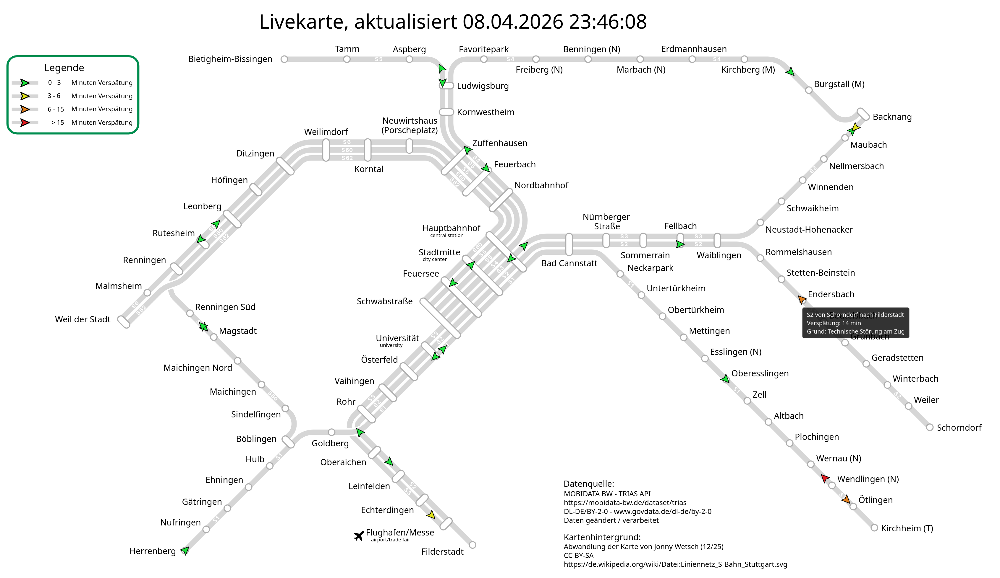

# Trias crawl
Utility to download live delay data from mobidata bw trias api and visualize delay for the S-Bahn Stuttgart.  
The required api key is **not** provided with this code.  
The frequently refreshed output of the code can be viewed [here](https://p0ng.de/trias/).  
## Demo screenshot

## Requirements
The project needs python with the libraries requests, svgpathtools, matplotlib and xmltodict.
On nixos it is possible to initialize a temporary development environment with the `nix develop` command.

## Notes on setting up the webserver
- disabled caching in apache or nginx, otherwise the svg images will not be refreshed on the client side
